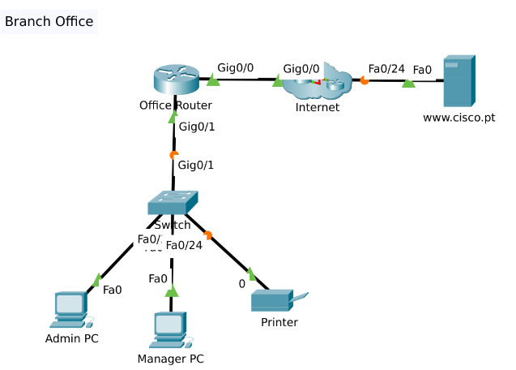

# Packet Tracer - Créer un réseau local (LAN)

## Objectifs

- Connecter les périphériques réseaux et les hôtes
- Configuration des périphériques avec adressage IPv4
- Configurer les Périphériques Finir et Vérifier la Connectivité
- Utiliser les commandes réseaux pour visualiser les informations sur l'organisateur

## Table d'adressage

| Appareil | Interface/Port | Adresse IPv4 | Masque de sous-réseau |
|----------|---------------|--------------|----------------------|
| PC administrateur | Carte réseau (NIC) | DHCP | N/A |
| Responsable PC | Carte réseau (NIC) | DHCP | N/A |
| Imprimante | Carte réseau (NIC) | 192.168.1.100 | 255.255.255.0 |
| www.cisco.pt | Carte réseau (NIC) | 209.165.200.225 | N/A |

**Tableau des connexions**

| Appareil | Interface/Port | connecté au périphérique | Connexion Port/Interface |
|----------|---------------|-------------------------|-------------------------|
| Routeur Office | G0/0 | FAI1 | G0/0 |
| Routeur Office | G0/1 | Commutateur | G0/1 |
| PC admin | NIC (F/0) | Commutateur | F0/1 |
| Responsable PC | NIC (F/0) | Commutateur | F0/2 |
| Imprimante | NIC (F/0) | Commutateur | F0/24 |

## Compétences acquises

- Câblage réseau (câbles droits Ethernet)
- Configuration DHCP client sur les hôtes
- Configuration d'adresse IP statique
- Compréhension des concepts de passerelle par défaut
- Utilisation des commandes réseau Windows (ipconfig, ping, tracert)
- Tests de connectivité locale et distante
- Dépannage DNS
- Topologie réseau de base (routeur, switch, hôtes)
