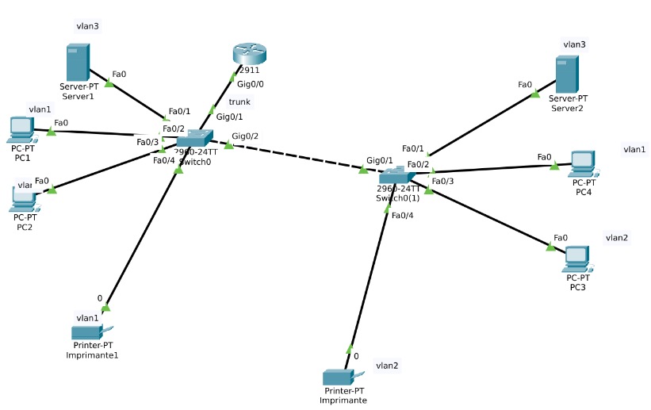

# Packet Tracer - Illustrer Routage InterVlan

## Objectifs

### Phase 1 : Configuration de base et connectivité
- Connecter tous les périphériques selon l'architecture réseau
- Configurer l'adressage IP sur tous les équipements
- Vérifier la connectivité entre tous les périphériques (test ping)

### Phase 2 : Segmentation du réseau avec VLANs
- Créer et configurer les VLANs (VLAN1, VLAN2, VLAN3)
- Assigner les ports des switches aux VLANs appropriés
- Configurer le trunk entre les switches
- Vérifier l'isolation : seuls les périphériques du même VLAN peuvent communiquer

### Phase 3 : Routage inter-VLAN
- Configurer le routage inter-VLAN sur le routeur
- Établir la connectivité entre les différents VLANs
- Vérifier que tous les périphériques peuvent communiquer entre eux malgré la segmentation VLAN

## Compétences acquises

- Utilisation du CLI Cisco (IOS)
- Configuration et gestion des VLANs
- Configuration des ports en mode access et trunk
- Subnetting et adressage IP
- Routage inter-VLAN (Router-on-a-Stick)
- Configuration de sous-interfaces sur un routeur
- Protocole 802.1Q (tagging VLAN)
- Tests de connectivité et dépannage réseau

[⬅ Retour au README principal](../README.md)

