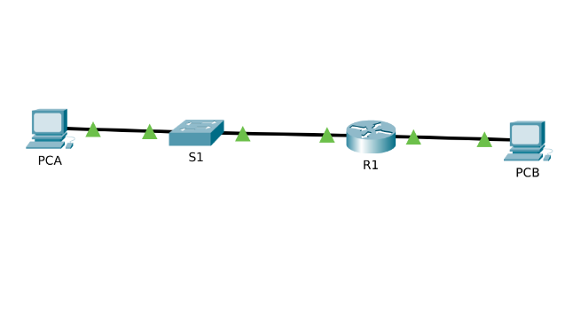

# Packet Tracer - Créer un réseau avec switch et routeur

## Objectifs

- Créer un réseau avec un switch, un routeur et deux PC
- Configurer le routage entre les réseaux
- Vérifier le bon fonctionnement et la connectivité entre les périphériques

## Table d'adressage

| Appareil | Interface | Adresse IP | Masque de sous-réseau | Passerelle par défaut |
|----------|-----------|------------|----------------------|----------------------|
| R1 | G0/0/0 | 192.168.0.1 | 255.255.255.0 | S/O |
| R1 | G0/0/1 | 192.168.1.1 | 255.255.255.0 | S/O |
| S1 | VLAN 1 | 192.168.1.2 | 255.255.255.0 | 192.168.1.1 |
| PCA | Carte réseau | 192.168.1.3 | 255.255.255.0 | 192.168.1.1 |
| PCB | Carte réseau | 192.168.0.3 | 255.255.255.0 | 192.168.0.1 |

## Compétences acquises

- Utilisation du CLI Cisco (IOS)
- Configuration d'interfaces sur un routeur
- Subnetting et plan d'adressage IPv4
- Configuration d'un switch (adresse IP de gestion)
- Routage entre réseaux
- Compréhension du rôle de la passerelle par défaut
- Tests de connectivité inter-réseaux (ping)
- Topologie multi-réseaux

[⬅ Retour au README principal](../README.md)

